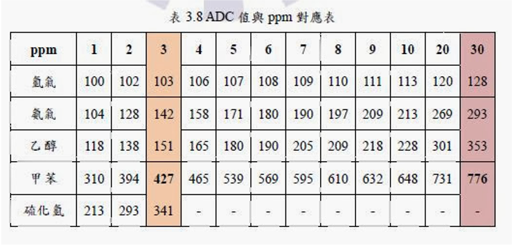

# Arduino Sensor Package

## **Content**
This package includes codes for following sensors:

 * TGS2602 Gas Sensor
 * Sharp GP2Y1051 Dust Sensor
 * MQ-135 Gas Sensor
 * MLX90614 Temp Sensor
 * DHT11 Grove Temperature & Humidity Sensor

Also a python tool script to help read and plot the data from sensors.

## **TGS2602 Gas Sensor**

This sensor is built for detecting ppm of certain gas molecules, such as VOC, ethanol, ammonia, Hydrogen sulphide, etc. This sensor **can't** distinguish different gas molecules. Please use the table cited below and your knowledge of your working environment to evaluate gas density according to ADC output.


* **Pin and circuit diagram**
  
    Use the following pin layout for example code.

    ```
    VCC  -->  arduino 5V
    GND  -->  arduino GND
    pin  -->  A2
    ```

    Circuit diagram with 10k resistor:

    

* **Table: ADV value versus different gas molecules PPM**
  
    Use this table to evaluate gas density according to ADC output.

    

    **cite from:**
    
    董威呈。「室內VOC氣體感測網路系統實作」。碩士論文，明新科技大學電機工程研究所，。

    Link to [paper site](https://hdl.handle.net/11296/g26nkt "Title").

## **Sharp GP2Y1051 Dust Sensor**

This sensor utilizes light emitter and reflection to detect dust concertration, which features high accuracy, good consistency and stability. It can detect concertration of PM2.5, cigarette smoke, dust, etc. This sensor also **can't** distinguish different kind of dust. 


* **Pin and circuit diagram**
  
    Use the following pin layout for example code.

    ```
    VCC(RED)    -->  arduino 5V
    GND(Black)  -->  arduino GND
    TX(White)  -->  10
    ```

    Note that the sensor's baud rate is **_2400bps_**.

* **Table: Output Voltage versus Dust Density**

    To get the output voltage value, the output of the sensor should be transformed by the following linear function. Due to the resolution of its voltage is from 0 to 1023 and the output of the sensor is from 0 to 5.

    $𝑎𝑑𝑐𝑣𝑜𝑙𝑡𝑎𝑔𝑒=𝑎𝑑𝑐𝑣𝑎𝑙𝑢𝑒 ∗5 /1024$

    Another linear transformation is needed to get the dust density from the output voltage. We can observe from the table below to get this linear transformation equation, ignoring the region lower 0.583 and higher than 3.5.

    $𝑑𝑢𝑠𝑡𝐶𝑜𝑛𝑐𝑒𝑛𝑡𝑟𝑎𝑡𝑖𝑜𝑛=\frac{6}{35}∗𝑎𝑑𝑐𝑣𝑜𝑙𝑡𝑎𝑔𝑒−0.1$

    

    By the two equations above, we can interpret the output value of the sensor.

## **MQ-135 Gas Sensor**

Featured with high stability and long lifespan, this sensor aims to detect ppm value of certain gas molecules, such as VOC, ammonia, sulfide, and especially precise and sensitive for carbon monoxide.


* **Pin and circuit diagram**

    Use the following pin layout for example code.

    ```
    VCC  -->  arduino 5V
    GND  -->  arduino GND
    AO   -->  A2
    ```

* **Import library**

    Download library on github from [here](https://github.com/MurrayBoz/NodeMCU-MQ135 "Title"). Then move downloaded library to your arduino library directory.

    This library includes function for sensor adjustment based on your current environment(humidity and temperature).

    

## **MLX90614 Temp Sensor**

This sensor measures infrared temperature with advantages of small size, non-contact, high precision, and small cost.


* **Pin and circuit diagram**

    Use the following pin layout for example code.

    ```
    VIN  -->  arduino 3.3V
    GND  -->  arduino GND
    SCL  -->  A5
    SDA  -->  A4
    ```

    Note that there is different function for reading ambient temperature and object temperature, be sure to choose the right one for your usage.

* **Import library**

    Using library from Adafruit.

## **DHT11 Grove Temperature & Humidity Sensor**

This sensor measures both temperature and humidity from the surrounding air by using a capacitive humidity sensor and a thermistor.

This example code is imported from the Arduino DHT11 library.


* **Pin and circuit diagram**

    ```
    VCC(+)  -->  arduino 5V
    GND(-)  -->  arduino GND
    OUT     -->  7
    ```

    Note that this sensor updates its data every two seconds, thus the output read from this sensor might be up to 2 seconds old.

* **Import library**

    Using library from Adafruit.

## **Python Tool Script (read.py)**

Simply run the script with given value for arguments mentioned below.

* Argument Parser

    ```
    -t, --title:    The title of the graph.
    -y, --ylabel:   The y label of the graph.
    -b, --baudrate: The baud rate of the UART connection.
    -i, --interval: Number of frames to plot
    -p, --port:     The port of the UART connection, which is required.
    ```

## **Contributers**
* YI-TE(Alex), Lyu 呂以德. Research Center for Information Technology Innovation, Academia Sinica
* Chieh-Ming(Jimmy), Chang 張傑名. Research Center for Information Technology Innovation, Academia Sinica